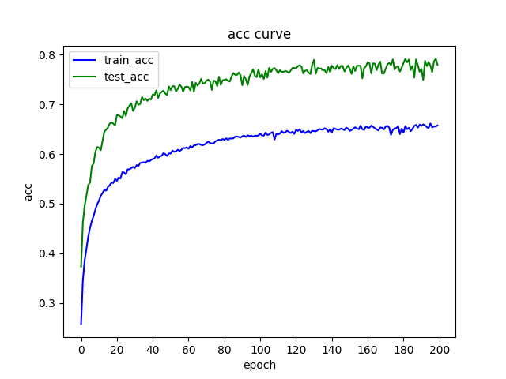
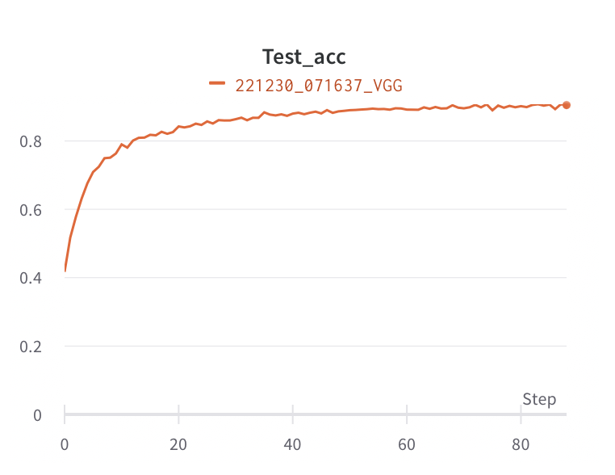

# Week_11

## Task
* 1.AlexNet网络训练和推理
* 2.VGG网络训练和推理
* 3.Resnet网络训练和推理

## 结果

### 1.AlexNet网络训练和推理
* 正确率：77.94%
 

### 2.VGG网络训练和推理
* 正确率：90.08%
 

### 3.Resnet网络训练和推理
* 训练方法: Finetuning
* 正确率：95.02%
 